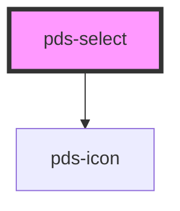

# pds-select

<!-- Auto Generated Below -->

## Properties

| Property                   | Attribute        | Description                                                                        | Type                 | Default     |
| -------------------------- | ---------------- | ---------------------------------------------------------------------------------- | -------------------- | ----------- |
| `autocomplete`             | `autocomplete`   | Specifies if and how the browser provides `autocomplete` assistance for the field. | `string`             | `undefined` |
| `componentId` _(required)_ | `component-id`   | A unique identifier used for the underlying component `id` attribute.              | `string`             | `undefined` |
| `disabled`                 | `disabled`       | Indicates whether or not the select field is disabled.                             | `boolean`            | `false`     |
| `errorMessage`             | `error-message`  | Specifies the error message and provides an error-themed treatment to the field.   | `string`             | `undefined` |
| `helperMessage`            | `helper-message` | Displays a message or hint below the input field.                                  | `string`             | `undefined` |
| `label`                    | `label`          | Text to be displayed as the select label.                                          | `string`             | `undefined` |
| `multiple`                 | `multiple`       | Indicates whether multiple options can be selected.                                | `boolean`            | `false`     |
| `name` _(required)_        | `name`           | Specifies the name. Submitted with the form name/value pair.                       | `string`             | `undefined` |
| `required`                 | `required`       | Indicates whether or not the select field is required.                             | `boolean`            | `false`     |
| `value`                    | `value`          | The value(s) of the selected option(s).                                            | `string \| string[]` | `undefined` |

## Events

| Event             | Description                             | Type                      |
| ----------------- | --------------------------------------- | ------------------------- |
| `pdsSelectChange` | Emitted when a keyboard input occurred. | `CustomEvent<InputEvent>` |

## Dependencies

### Depends on

- pds-icon

### Graph

----------------------------------------------

