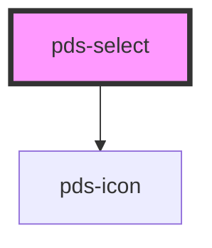

# pds-select


<!-- Auto Generated Below -->


## Overview

PdsSelect - A dropdown selection component with validation and accessibility

**⚠️ CRITICAL BEHAVIOR:**
- **Form Integration**: Automatically handles form submission and validation
- **Validation States**: Supports error messages and invalid states
- **Accessibility**: Full ARIA support with proper labeling and descriptions
- **Multiple Selection**: Supports single and multiple option selection
- **Option Management**: Uses slot-based option content for flexibility

**⚠️ VISUAL PATTERN CLARIFICATION:**

When analyzing screenshots or visual layouts:
- **Text above select dropdown**: This is the select's LABEL, not a separate `pds-text` component
- **Label Integration**: The `label` prop creates text that appears above the select field
- **No Separate Text Needed**: Do not add `pds-text` components for select labels
- **Visual Hierarchy**: Label text is styled and positioned automatically by the select component

**Common Mistake**: Seeing text above a select dropdown and assuming it's a separate `pds-text` component
**Correct Understanding**: The text is the select's integrated label created by the `label` prop

**Usage Examples:**
```tsx
// Basic select
<pds-select label="Country" component-id="country" name="country">
  <option value="us">United States</option>
  <option value="ca">Canada</option>
  <option value="uk">United Kingdom</option>
</pds-select>

// Select with validation
<pds-select
  label="Category"
  component-id="category"
  required
  helper-message="Please select a category"
>
  <option value="">Select a category</option>
  <option value="tech">Technology</option>
  <option value="design">Design</option>
</pds-select>

// Multiple select
<pds-select
  label="Skills"
  component-id="skills"
  multiple="true"
>
  <option value="js">JavaScript</option>
  <option value="react">React</option>
  <option value="node">Node.js</option>
</pds-select>

// ❌ INCORRECT - Don't add separate text for labels
<pds-text>Country</pds-text>
<pds-select component-id="country">
  <option value="us">United States</option>
</pds-select>

// ✅ CORRECT - Use the label prop
<pds-select label="Country" component-id="country">
  <option value="us">United States</option>
</pds-select>
```

## Properties

| Property                   | Attribute        | Description                                                                                                                                                                                                                                                                                                                                                                                                                                                                                                                                                                                                                                                                                                                                                                                                                                                                       | Type                 | Default     |
| -------------------------- | ---------------- | --------------------------------------------------------------------------------------------------------------------------------------------------------------------------------------------------------------------------------------------------------------------------------------------------------------------------------------------------------------------------------------------------------------------------------------------------------------------------------------------------------------------------------------------------------------------------------------------------------------------------------------------------------------------------------------------------------------------------------------------------------------------------------------------------------------------------------------------------------------------------------- | -------------------- | ----------- |
| `autocomplete`             | `autocomplete`   | Specifies if and how the browser provides `autocomplete` assistance for the field.                                                                                                                                                                                                                                                                                                                                                                                                                                                                                                                                                                                                                                                                                                                                                                                                | `string`             | `undefined` |
| `componentId` _(required)_ | `component-id`   | A unique identifier used for the underlying component `id` attribute.                                                                                                                                                                                                                                                                                                                                                                                                                                                                                                                                                                                                                                                                                                                                                                                                             | `string`             | `undefined` |
| `disabled`                 | `disabled`       | Indicates whether or not the select field is disabled.                                                                                                                                                                                                                                                                                                                                                                                                                                                                                                                                                                                                                                                                                                                                                                                                                            | `boolean`            | `false`     |
| `errorMessage`             | `error-message`  | Displays error message text describing an invalid state.                                                                                                                                                                                                                                                                                                                                                                                                                                                                                                                                                                                                                                                                                                                                                                                                                          | `string`             | `undefined` |
| `helperMessage`            | `helper-message` | Displays helper message text below select.                                                                                                                                                                                                                                                                                                                                                                                                                                                                                                                                                                                                                                                                                                                                                                                                                                        | `string`             | `undefined` |
| `hideLabel`                | `hide-label`     | Visually hides the label text for instances where only the checkbox should be displayed. Label remains accessible to assistive technology such as screen readers.                                                                                                                                                                                                                                                                                                                                                                                                                                                                                                                                                                                                                                                                                                                 | `boolean`            | `undefined` |
| `invalid`                  | `invalid`        | Determines whether or not the select is invalid.                                                                                                                                                                                                                                                                                                                                                                                                                                                                                                                                                                                                                                                                                                                                                                                                                                  | `boolean`            | `undefined` |
| `label`                    | `label`          | Text to be displayed as the select label.  **⚠️ CRITICAL VISUAL BEHAVIOR:** - **Integrated Label**: Creates text that appears ABOVE the select dropdown - **Not Separate Component**: This is NOT a separate `pds-text` component - **Automatic Styling**: Label is styled and positioned by the select component - **Visual Hierarchy**: Creates proper visual relationship between label and select  **Accessibility Impact:** - Creates proper label-select association - Required for screen reader accessibility - Shows required indicator (*) when `required="true"` - Sets `for` attribute to link with select  **⚠️ COMMON MISTAKE**: When analyzing screenshots, text above a select dropdown is the LABEL, not a separate text component  **Best Practice**: Always provide descriptive labels for select fields  **Example**: `label="Country"` for country selection | `string`             | `undefined` |
| `multiple`                 | `multiple`       | Indicates whether multiple options can be selected.                                                                                                                                                                                                                                                                                                                                                                                                                                                                                                                                                                                                                                                                                                                                                                                                                               | `boolean`            | `false`     |
| `name` _(required)_        | `name`           | Specifies the name. Submitted with the form name/value pair.                                                                                                                                                                                                                                                                                                                                                                                                                                                                                                                                                                                                                                                                                                                                                                                                                      | `string`             | `undefined` |
| `required`                 | `required`       | Indicates whether or not the select field is required.                                                                                                                                                                                                                                                                                                                                                                                                                                                                                                                                                                                                                                                                                                                                                                                                                            | `boolean`            | `false`     |
| `value`                    | `value`          | The value(s) of the selected option(s).                                                                                                                                                                                                                                                                                                                                                                                                                                                                                                                                                                                                                                                                                                                                                                                                                                           | `string \| string[]` | `undefined` |


## Events

| Event             | Description                           | Type                      |
| ----------------- | ------------------------------------- | ------------------------- |
| `pdsSelectChange` | Emitted when a keyboard input occurs. | `CustomEvent<InputEvent>` |


## Slots

| Slot       | Description                                                                  |
| ---------- | ---------------------------------------------------------------------------- |
| `"action"` | Content to be displayed in the label area, typically for help icons or links |


## Shadow Parts

| Part       | Description |
| ---------- | ----------- |
| `"action"` |             |
| `"select"` |             |


## Dependencies

### Depends on

- pds-icon

### Graph


----------------------------------------------


