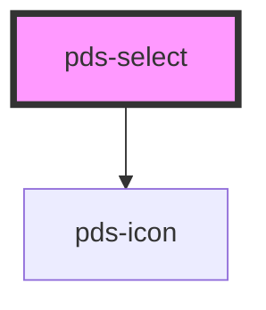

# pds-select

<!-- Auto Generated Below -->

## Properties

| Property                   | Attribute               | Description                                                                  | Type      | Default     |
| -------------------------- | ----------------------- | ---------------------------------------------------------------------------- | --------- | ----------- |
| `componentId` _(required)_ | `component-id`          | A unique identifier for the combobox                                         | `string`  | `undefined` |
| `disabled`                 | `disabled`              | Indicates that the combobox is disabled                                      | `boolean` | `false`     |
| `errorMessage`             | `error-message`         | Specifies the error text and provides an error-themed treatment to the field | `string`  | `undefined` |
| `hintMessage`              | `hint-message`          | Displays a hint or description of the combobox                               | `string`  | `undefined` |
| `invalid`                  | `invalid`               | Indicates  whether or not the input field is invalid or throws an error      | `boolean` | `false`     |
| `isComboboxOpen`           | `is-combobox-open`      | Is enabled when the combobox is open                                         | `boolean` | `false`     |
| `label`                    | `label`                 | Text to be displayed as the combobox label                                   | `string`  | `undefined` |
| `readonly`                 | `readonly`              |                                                                              | `boolean` | `false`     |
| `required`                 | `required`              |                                                                              | `boolean` | `false`     |
| `selectedOptionId`         | `selected-option-id`    | The display id for the selected option                                       | `string`  | `undefined` |
| `selectedOptionText`       | `selected-option-text`  | The display text for the selected option                                     | `string`  | `undefined` |
| `selectedOptionValue`      | `selected-option-value` | The value for the selected option                                            | `string`  | `undefined` |

## Events

| Event             | Description                                                | Type                  |
| ----------------- | ---------------------------------------------------------- | --------------------- |
| `pdsSelectChange` | Emitted when the select value changes from selected option | `CustomEvent<string>` |

## Dependencies

### Depends on

- pds-icon

### Graph

----------------------------------------------

