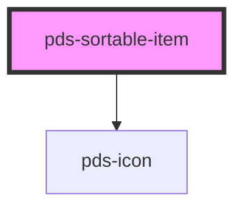

# pds-sortable-item

<!-- Auto Generated Below -->

## Properties

| Property        | Attribute        | Description                                                        | Type      | Default     |
| --------------- | ---------------- | ------------------------------------------------------------------ | --------- | ----------- |
| `componentId`   | `component-id`   | A unique identifier for the sortable item.                         | `string`  | `undefined` |
| `enableActions` | `enable-actions` | Determines whether `sortable-item-actions` slot should be enabled. | `boolean` | `false`     |
| `handle`        | `handle`         | Determines whether `sortable-item` should have a handle.           | `boolean` | `false`     |

## Slots

| Slot                      | Description                                                                                                                              |
| ------------------------- | ---------------------------------------------------------------------------------------------------------------------------------------- |
| `"sortable-item-actions"` | Content is placed within the `pds-sortable-item__actions` element as children. This slot is only rendered if `actions` is set to `true`. |

## Dependencies

### Depends on

- pds-icon

### Graph

----------------------------------------------

