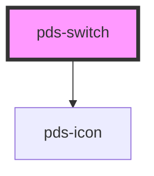

# pds-switch

<!-- Auto Generated Below -->

## Properties

| Property                   | Attribute        | Description                                                                                                                                                     | Type      | Default     |
| -------------------------- | ---------------- | --------------------------------------------------------------------------------------------------------------------------------------------------------------- | --------- | ----------- |
| `checked`                  | `checked`        | Determines the input 'checked' state.                                                                                                                           | `boolean` | `false`     |
| `componentId` _(required)_ | `component-id`   | A unique identifier used for the underlying component `id` attribute and the label `for` attribute.                                                             | `string`  | `undefined` |
| `disabled`                 | `disabled`       | Determines the input 'disabled' state, preventing user interaction.                                                                                             | `boolean` | `false`     |
| `errorMessage`             | `error-message`  | Displays message text describing an invalid state.                                                                                                              | `string`  | `undefined` |
| `helperMessage`            | `helper-message` | Displays help text for additional description of an input.                                                                                                      | `string`  | `undefined` |
| `invalid`                  | `invalid`        | Determines the input 'invalid' state, signifying an error is present.                                                                                           | `boolean` | `false`     |
| `label` _(required)_       | `label`          | Displays text to describe the input.                                                                                                                            | `string`  | `undefined` |
| `labelHidden`              | `label-hidden`   | Visually hides the label text for instances where only the switch should be displayed. Label remains accessible to assistive technology such as screen readers. | `boolean` | `undefined` |
| `name`                     | `name`           | Identifies form data and unifies a group of radio inputs for toggling a single property/value.                                                                  | `string`  | `undefined` |
| `required`                 | `required`       | Determines the 'required' state of the input.                                                                                                                   | `boolean` | `false`     |
| `value`                    | `value`          | Provides input with a string submitted in form data.                                                                                                            | `string`  | `undefined` |

## Events

| Event             | Description                     | Type                      |
| ----------------- | ------------------------------- | ------------------------- |
| `pdsSwitchChange` | Emits an event on input change. | `CustomEvent<InputEvent>` |

## Dependencies

### Depends on

- pds-icon

### Graph

----------------------------------------------

