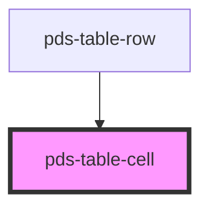

# pds-table-cell

<!-- Auto Generated Below -->

## Properties

| Property   | Attribute  | Description                                                     | Type      | Default     |
| ---------- | ---------- | --------------------------------------------------------------- | --------- | ----------- |
| `truncate` | `truncate` | Truncates content to a max width of 100px and adds an ellipsis. | `boolean` | `undefined` |

## Dependencies

### Used by

 - [pds-table-row](../pds-table-row)

### Graph

----------------------------------------------

