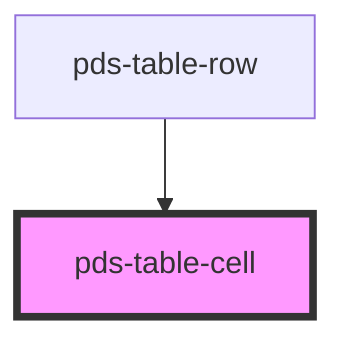

# pds-table-cell

<!-- Auto Generated Below -->

## Properties

| Property    | Attribute    | Description                                                                                                                             | Type                                        | Default     |
| ----------- | ------------ | --------------------------------------------------------------------------------------------------------------------------------------- | ------------------------------------------- | ----------- |
| `cellAlign` | `cell-align` | Sets the text alignment within the cell.                                                                                                | `"center" \| "end" \| "justify" \| "start"` | `undefined` |
| `truncate`  | `truncate`   | Truncates content to a max width and adds an ellipsis. When text overflows, a tooltip showing the full text will appear on hover/focus. | `boolean`                                   | `undefined` |

## Shadow Parts

| Part     | Description |
| -------- | ----------- |
| `"cell"` |             |

## Dependencies

### Used by

 - [pds-table-row](../pds-table-row)

### Graph

----------------------------------------------

