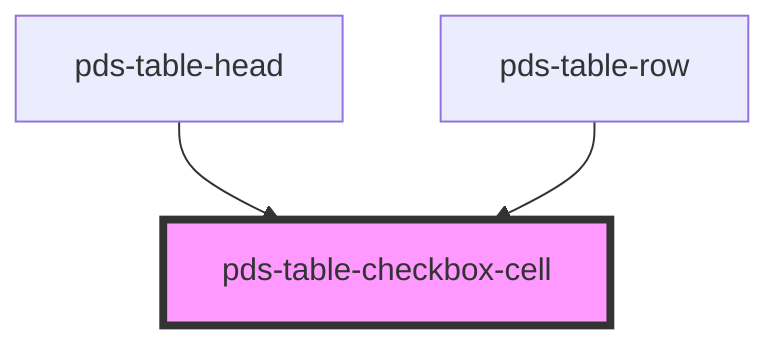

# pds-table-checkbox-cell

<!-- Auto Generated Below -->

## Dependencies

### Used by

 - [pds-table-head](../pds-table-head)
 - [pds-table-row](../pds-table-row)

### Graph

----------------------------------------------

