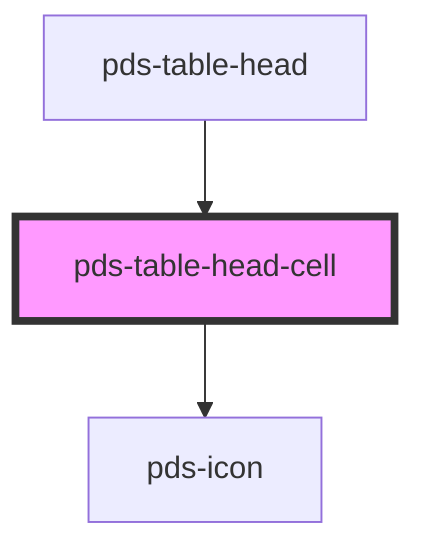

# pds-table-head-cell

<!-- Auto Generated Below -->

## Properties

| Property    | Attribute    | Description                                                         | Type                                        | Default     |
| ----------- | ------------ | ------------------------------------------------------------------- | ------------------------------------------- | ----------- |
| `cellAlign` | `cell-align` | Sets the text alignment within the head cell.                       | `"center" \| "end" \| "justify" \| "start"` | `undefined` |
| `sortable`  | `sortable`   | Determines whether the table column is sortable when set to `true`. | `boolean`                                   | `undefined` |

## Events

| Event          | Description                                                                                                                                     | Type                                                  |
| -------------- | ----------------------------------------------------------------------------------------------------------------------------------------------- | ----------------------------------------------------- |
| `pdsTableSort` | Event emitted to signal that a table column header has been sorted, providing information about the sorted column's name and sorting direction. | `CustomEvent<{ column: string; direction: string; }>` |

## Methods

### `clearActiveSort() => Promise<void>`

Clears the active sort state from this column.
Used internally when another column becomes active.

#### Returns

Type: `Promise<void>`

### `setActiveSort(direction: "asc" | "desc") => Promise<void>`

Programmatically sets this column as the active sort column with the specified direction.
Used by pds-table to apply a default sort on initial load.

#### Parameters

| Name        | Type              | Description                                     |
| ----------- | ----------------- | ----------------------------------------------- |
| `direction` | `"desc" \| "asc"` | - The sort direction to apply ('asc' or 'desc') |

#### Returns

Type: `Promise<void>`

## Shadow Parts

| Part          | Description |
| ------------- | ----------- |
| `"head-cell"` |             |
| `"sort-icon"` |             |

## Dependencies

### Used by

 - [pds-table-head](../pds-table-head)

### Depends on

- pds-icon

### Graph

----------------------------------------------

