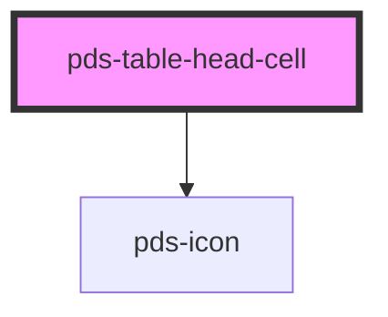

# pds-table-head-cell

<!-- Auto Generated Below -->

## Properties

| Property   | Attribute  | Description                                                         | Type      | Default     |
| ---------- | ---------- | ------------------------------------------------------------------- | --------- | ----------- |
| `sortable` | `sortable` | Determines whether the table column is sortable when set to `true`. | `boolean` | `undefined` |

## Events

| Event          | Description                                                                                                                                     | Type                                                  |
| -------------- | ----------------------------------------------------------------------------------------------------------------------------------------------- | ----------------------------------------------------- |
| `pdsTableSort` | Event emitted to signal that a table column header has been sorted, providing information about the sorted column's name and sorting direction. | `CustomEvent<{ column: string; direction: string; }>` |

## Dependencies

### Depends on

- pds-icon

### Graph

----------------------------------------------

