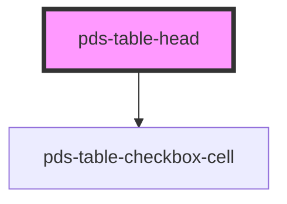

# pds-table-head

<!-- Auto Generated Below -->

## Properties

| Property     | Attribute    | Description                                                                | Type      | Default     |
| ------------ | ------------ | -------------------------------------------------------------------------- | --------- | ----------- |
| `selectable` | `selectable` | Prop to receive the selectable value from the `pdsTable` parent component. | `boolean` | `undefined` |

## Dependencies

### Depends on

- [pds-table-checkbox-cell](../pds-table-checkbox-cell)

### Graph

----------------------------------------------

