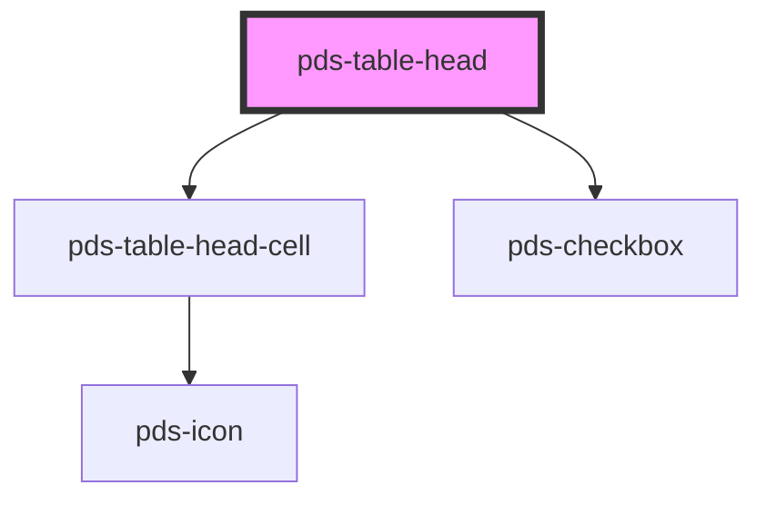

# pds-table-head

<!-- Auto Generated Below -->

## Properties

| Property        | Attribute       | Description                                                   | Type      | Default     |
| --------------- | --------------- | ------------------------------------------------------------- | --------- | ----------- |
| `indeterminate` | `indeterminate` | Indicates that the selection state is indeterminate.          | `boolean` | `undefined` |
| `isSelected`    | `is-selected`   | A local state to track whether the row is currently selected. | `boolean` | `undefined` |

## Events

| Event               | Description                                                                                 | Type                                    |
| ------------------- | ------------------------------------------------------------------------------------------- | --------------------------------------- |
| `pdsTableSelectAll` | Event that is emitted when the select all checkbox is clicked, carrying the selected value. | `CustomEvent<{ isSelected: boolean; }>` |

## Dependencies

### Depends on

- [pds-table-head-cell](../pds-table-head-cell)
- [pds-checkbox](../../pds-checkbox)

### Graph

----------------------------------------------

