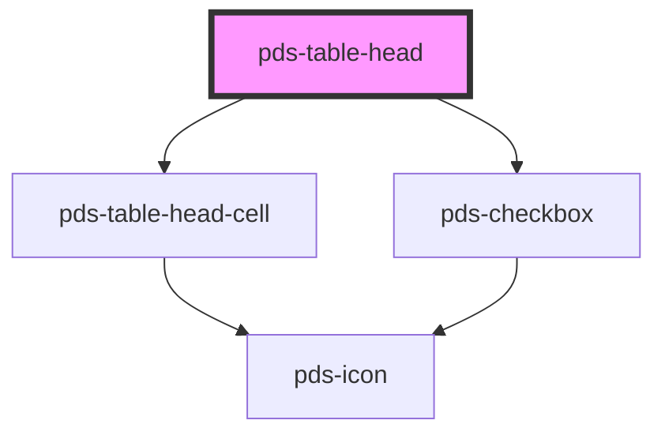

# pds-table-head

<!-- Auto Generated Below -->

## Properties

| Property        | Attribute       | Description                                                         | Type      | Default     |
| --------------- | --------------- | ------------------------------------------------------------------- | --------- | ----------- |
| `indeterminate` | `indeterminate` | Determines if the select all checkbox is in an indeterminate state. | `boolean` | `undefined` |
| `isSelected`    | `is-selected`   | Determines if the table row is currently selected.                  | `boolean` | `undefined` |

## Events

| Event               | Description                                                                                 | Type                                    |
| ------------------- | ------------------------------------------------------------------------------------------- | --------------------------------------- |
| `pdsTableSelectAll` | Event that is emitted when the select all checkbox is clicked, carrying the selected value. | `CustomEvent<{ isSelected: boolean; }>` |

## Shadow Parts

| Part                    | Description |
| ----------------------- | ----------- |
| `"head"`                |             |
| `"select-all-checkbox"` |             |

## Dependencies

### Depends on

- [pds-table-head-cell](../pds-table-head-cell)
- [pds-checkbox](../../pds-checkbox)

### Graph

----------------------------------------------

