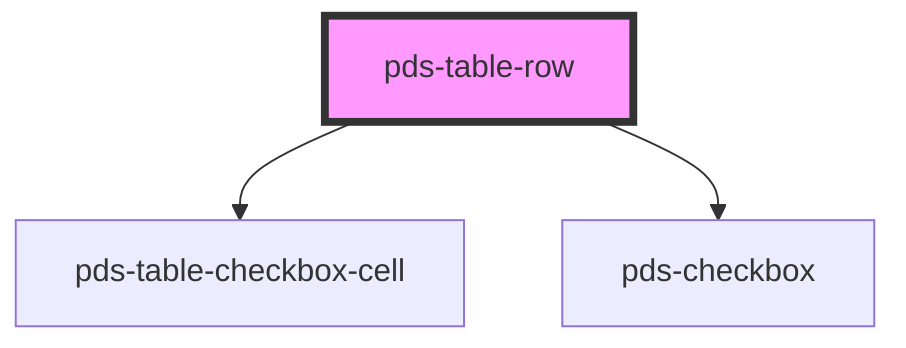

# pds-table-row

<!-- Auto Generated Below -->

## Properties

| Property     | Attribute    | Description | Type      | Default     |
| ------------ | ------------ | ----------- | --------- | ----------- |
| `selectable` | `selectable` |             | `boolean` | `undefined` |
| `value`      | `value`      |             | `string`  | `undefined` |

## Dependencies

### Depends on

- [pds-table-checkbox-cell](../pds-table-checkbox-cell)
- [pds-checkbox](../../pds-checkbox)

### Graph

----------------------------------------------

