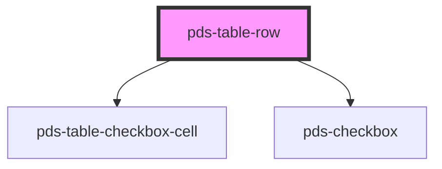

# pds-table-row

<!-- Auto Generated Below -->

## Events

| Event                 | Description                                                                      | Type                                                   |
| --------------------- | -------------------------------------------------------------------------------- | ------------------------------------------------------ |
| `pdsTableRowSelected` | Event that is emitted when the checkbox is clicked, carrying the selected value. | `CustomEvent<{ value: string; isSelected: boolean; }>` |

## Dependencies

### Depends on

- [pds-table-checkbox-cell](../pds-table-checkbox-cell)
- [pds-checkbox](../../pds-checkbox)

### Graph

----------------------------------------------

