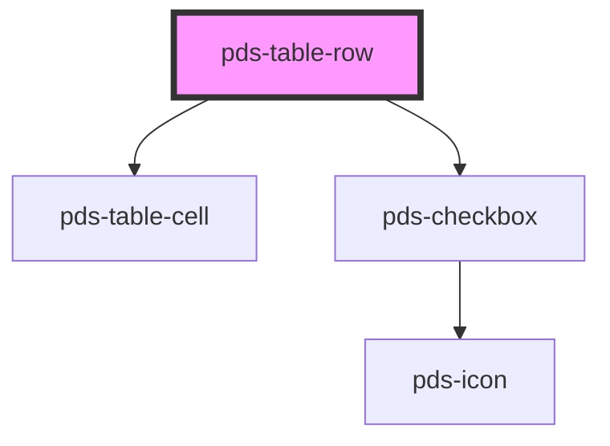

# pds-table-row

<!-- Auto Generated Below -->

## Properties

| Property        | Attribute       | Description                                                  | Type      | Default     |
| --------------- | --------------- | ------------------------------------------------------------ | --------- | ----------- |
| `indeterminate` | `indeterminate` | Determines if the row selected is in an indeterminate state. | `boolean` | `undefined` |
| `isSelected`    | `is-selected`   | Determines if the table row is currently selected.           | `boolean` | `undefined` |

## Events

| Event                 | Description                                                                      | Type                                                      |
| --------------------- | -------------------------------------------------------------------------------- | --------------------------------------------------------- |
| `pdsTableRowSelected` | Event that is emitted when the checkbox is clicked, carrying the selected value. | `CustomEvent<{ rowIndex: number; isSelected: boolean; }>` |

## Shadow Parts

| Part             | Description |
| ---------------- | ----------- |
| `"row"`          |             |
| `"row-checkbox"` |             |

## Dependencies

### Depends on

- [pds-table-cell](../pds-table-cell)
- [pds-checkbox](../../pds-checkbox)

### Graph

----------------------------------------------

