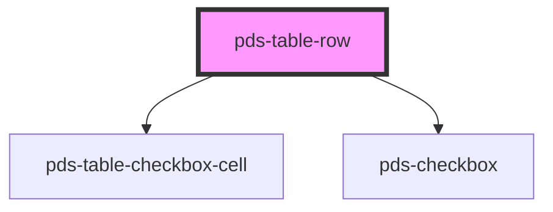

# pds-table-row

<!-- Auto Generated Below -->

## Properties

| Property | Attribute | Description                                                                 | Type     | Default     |
| -------- | --------- | --------------------------------------------------------------------------- | -------- | ----------- |
| `value`  | `value`   | A property to hold the value associated with the row and the `pdsCheckbox`. | `string` | `undefined` |

## Events

| Event                 | Description                                                                      | Type                  |
| --------------------- | -------------------------------------------------------------------------------- | --------------------- |
| `pdsTableRowSelected` | Event that is emitted when the checkbox is clicked, carrying the selected value. | `CustomEvent<string>` |

## Dependencies

### Depends on

- [pds-table-checkbox-cell](../pds-table-checkbox-cell)
- [pds-checkbox](../../pds-checkbox)

### Graph

----------------------------------------------

