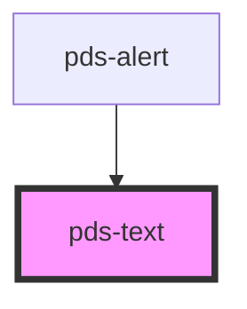

# pds-text


<!-- Auto Generated Below -->


## Overview

PdsText - A versatile text component for content display

**⚠️ CRITICAL USAGE CLARIFICATION:**
- **Content Display**: Use for general text content, headings, paragraphs, etc.
- **NOT for Input Labels**: Do NOT use for input field labels - use the `label` prop on input components instead
- **Semantic Text**: Renders appropriate HTML tags (p, h1-h6, code, etc.)
- **Typography Control**: Provides size, weight, color, and alignment options

**Common Use Cases:**
- **Headings**: Use with `tag="h1"` through `tag="h6"`
- **Body Text**: Use with `tag="p"` for paragraphs
- **Code**: Use with `tag="code"` or `tag="pre"` for code snippets
- **Emphasis**: Use with `tag="strong"` or `tag="em"` for emphasis

**⚠️ INPUT LABEL MISTAKE:**
When you see text above an input field in a screenshot:
- **That's the input's LABEL**, not a separate `pds-text` component
- **Use the `label` prop** on the input component instead
- **Example**: `<pds-input label="Email" component-id="email"></pds-input>`

**Usage Examples:**
```tsx
// Heading
<pds-text tag="h1" size="h1" weight="bold">Page Title</pds-text>

// Body text
<pds-text tag="p" size="md">This is body text content.</pds-text>

// Code snippet
<pds-text tag="code" size="sm">const example = "code";</pds-text>

// ❌ INCORRECT - Don't use for input labels
<pds-text>Email Address</pds-text>
<pds-input component-id="email"></pds-input>

// ✅ CORRECT - Use input label prop
<pds-input label="Email Address" component-id="email"></pds-input>
```

## Properties

| Property     | Attribute    | Description                                                                      | Type                                                                                                     | Default     |
| ------------ | ------------ | -------------------------------------------------------------------------------- | -------------------------------------------------------------------------------------------------------- | ----------- |
| `align`      | `align`      | Sets the text alignment.                                                         | `"center" \| "end" \| "justify" \| "start"`                                                              | `undefined` |
| `color`      | `color`      | Sets the text color.                                                             | `string`                                                                                                 | `undefined` |
| `decoration` | `decoration` | Sets the text decoration.                                                        | `"strikethrough" \| "underline-dotted"`                                                                  | `undefined` |
| `gutter`     | `gutter`     | Set the bottom margin for the text.                                              | `"2xl" \| "2xs" \| "lg" \| "md" \| "sm" \| "xl" \| "xs"`                                                 | `undefined` |
| `italic`     | `italic`     | If set or `true`, the text will be italic.                                       | `boolean`                                                                                                | `undefined` |
| `size`       | `size`       | Sets the font size.                                                              | `"2xl" \| "2xs" \| "h1" \| "h2" \| "h3" \| "h4" \| "h5" \| "h6" \| "lg" \| "md" \| "sm" \| "xl" \| "xs"` | `undefined` |
| `tag`        | `tag`        | Determines what semantic text tag to render.                                     | `"code" \| "em" \| "h1" \| "h2" \| "h3" \| "h4" \| "h5" \| "h6" \| "p" \| "pre" \| "strong"`             | `"p"`       |
| `truncate`   | `truncate`   | If set or `true`, the text will be truncated. Must add a `width` to the element. | `boolean`                                                                                                | `undefined` |
| `weight`     | `weight`     | Sets the font weight.                                                            | `"bold" \| "extra-light" \| "light" \| "medium" \| "regular" \| "semibold"`                              | `undefined` |


## Shadow Parts

| Part        | Description                |
| ----------- | -------------------------- |
| `"content"` | The text content container |


## Dependencies

### Used by

 - [pds-alert](../pds-alert)

### Graph


----------------------------------------------


