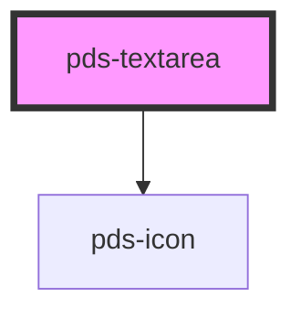

# pds-textarea

<!-- Auto Generated Below -->

## Properties

| Property                   | Attribute        | Description                                                                                          | Type      | Default            |
| -------------------------- | ---------------- | ---------------------------------------------------------------------------------------------------- | --------- | ------------------ |
| `autocomplete`             | `autocomplete`   | Specifies if and how the browser provides `autocomplete` assistance for the field.                   | `string`  | `undefined`        |
| `componentId` _(required)_ | `component-id`   | A unique identifier used for the underlying component `id` attribute.                                | `string`  | `undefined`        |
| `debounce`                 | `debounce`       | The amount of time, in milliseconds, to wait to trigger the event after each keystroke.              | `number`  | `undefined`        |
| `disabled`                 | `disabled`       | Determines whether or not the textarea is disabled.                                                  | `boolean` | `false`            |
| `errorMessage`             | `error-message`  | Displays an error message below the textarea field.                                                  | `string`  | `undefined`        |
| `helperMessage`            | `helper-message` | Displays a message or hint below the textarea field.                                                 | `string`  | `undefined`        |
| `invalid`                  | `invalid`        | Determines whether or not the textarea is invalid or throws an error.                                | `boolean` | `false`            |
| `label`                    | `label`          | Text to be displayed as the textarea label.                                                          | `string`  | `undefined`        |
| `name`                     | `name`           | Specifies the name. Submitted with the form name/value pair. This value will mirror the componentId. | `string`  | `this.componentId` |
| `placeholder`              | `placeholder`    | Specifies a short hint that describes the expected value of the textarea.                            | `string`  | `undefined`        |
| `readonly`                 | `readonly`       | Determines whether or not the textarea is readonly.                                                  | `boolean` | `false`            |
| `required`                 | `required`       | Determines whether or not the textarea is required.                                                  | `boolean` | `false`            |
| `rows`                     | `rows`           | Sets number of rows of text visible without needing to scroll in the textarea.                       | `number`  | `undefined`        |
| `value`                    | `value`          | The value of the textarea.                                                                           | `string`  | `''`               |

## Events

| Event               | Description                                                                                                                                                                                                                                                                                                                                                    | Type                                     |
| ------------------- | -------------------------------------------------------------------------------------------------------------------------------------------------------------------------------------------------------------------------------------------------------------------------------------------------------------------------------------------------------------- | ---------------------------------------- |
| `pdsBlur`           | Emitted when the input loses focus.                                                                                                                                                                                                                                                                                                                            | `CustomEvent<FocusEvent>`                |
| `pdsFocus`          | Emitted when the input has focus.                                                                                                                                                                                                                                                                                                                              | `CustomEvent<FocusEvent>`                |
| `pdsInput`          | Emitted when a keyboard input occurs.  For elements that accept text input (`type=text`, `type=tel`, etc.), the interface is [`InputEvent`](https://developer.mozilla.org/en-US/docs/Web/API/InputEvent); for others, the interface is [`Event`](https://developer.mozilla.org/en-US/docs/Web/API/Event). If the input is cleared on edit, the type is `null`. | `CustomEvent<TextareaInputEventDetail>`  |
| `pdsTextareaChange` | Event emitted whenever the value of the textarea changes.  This event will not emit when programmatically setting the `value` property.                                                                                                                                                                                                                        | `CustomEvent<TextareaChangeEventDetail>` |

## Methods

### `setFocus() => Promise<void>`

Sets focus on the native `textarea` in the `pds-texarea`. Use this method instead of the global
`textarea.focus()`.

#### Returns

Type: `Promise<void>`

## Dependencies

### Depends on

- pds-icon

### Graph

----------------------------------------------

