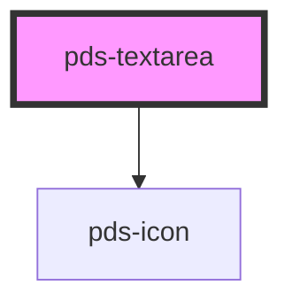

# pds-textarea

<!-- Auto Generated Below -->

## Properties

| Property                   | Attribute        | Description                                                                                          | Type      | Default            |
| -------------------------- | ---------------- | ---------------------------------------------------------------------------------------------------- | --------- | ------------------ |
| `autocomplete`             | `autocomplete`   | Specifies if and how the browser provides `autocomplete` assistance for the field.                   | `string`  | `undefined`        |
| `componentId` _(required)_ | `component-id`   | A unique identifier used for the underlying component `id` attribute.                                | `string`  | `undefined`        |
| `disabled`                 | `disabled`       | Determines whether or not the textarea is disabled.                                                  | `boolean` | `false`            |
| `errorMessage`             | `error-message`  | Specifies the error message and provides an error-themed treatment to the field.                     | `string`  | `undefined`        |
| `helperMessage`            | `helper-message` | Displays a message or hint below the textarea field.                                                 | `string`  | `undefined`        |
| `invalid`                  | `invalid`        | Determines whether or not the textarea is invalid or throws an error.                                | `boolean` | `false`            |
| `label`                    | `label`          | Text to be displayed as the textarea label.                                                          | `string`  | `undefined`        |
| `name`                     | `name`           | Specifies the name. Submitted with the form name/value pair. This value will mirror the componentId. | `string`  | `this.componentId` |
| `placeholder`              | `placeholder`    | Specifies a short hint that describes the expected value of the textarea.                            | `string`  | `undefined`        |
| `readonly`                 | `readonly`       | Determines whether or not the textarea is readonly.                                                  | `boolean` | `false`            |
| `required`                 | `required`       | Determines whether or not the textarea is required.                                                  | `boolean` | `false`            |
| `rows`                     | `rows`           | Sets number of rows of text visible without needing to scroll in the textarea.                       | `number`  | `undefined`        |
| `value`                    | `value`          | The value of the textarea.                                                                           | `string`  | `undefined`        |

## Events

| Event               | Description                                               | Type                                     |
| ------------------- | --------------------------------------------------------- | ---------------------------------------- |
| `pdsTextareaChange` | Event emitted whenever the value of the textarea changes. | `CustomEvent<TextareaChangeEventDetail>` |

## Dependencies

### Depends on

- pds-icon

### Graph

----------------------------------------------

