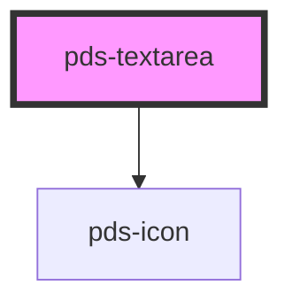

# pds-textarea


<!-- Auto Generated Below -->


## Overview

PdsTextarea - A multi-line text input component with validation and accessibility

**⚠️ CRITICAL BEHAVIOR:**
- **Form Integration**: Automatically handles form submission and validation
- **Validation States**: Supports error messages and invalid states
- **Accessibility**: Full ARIA support with proper labeling and descriptions
- **Event Handling**: Debounced input events and change detection
- **Resizable**: Users can resize the textarea vertically

**⚠️ VISUAL PATTERN CLARIFICATION:**

When analyzing screenshots or visual layouts:
- **Text above textarea**: This is the textarea's LABEL, not a separate `pds-text` component
- **Label Integration**: The `label` prop creates text that appears above the textarea field
- **No Separate Text Needed**: Do not add `pds-text` components for textarea labels
- **Visual Hierarchy**: Label text is styled and positioned automatically by the textarea component

**Common Mistake**: Seeing text above a textarea and assuming it's a separate `pds-text` component
**Correct Understanding**: The text is the textarea's integrated label created by the `label` prop

**Usage Examples:**
```tsx
// Basic textarea
<pds-textarea label="Description" component-id="description" rows="4"></pds-textarea>

// Textarea with validation
<pds-textarea
  label="Comments"
  component-id="comments"
  required
  helper-message="Please provide detailed feedback"
></pds-textarea>

// Textarea with error state
<pds-textarea
  label="Bio"
  component-id="bio"
  invalid="true"
  error-message="Bio must be at least 10 characters"
></pds-textarea>

// ❌ INCORRECT - Don't add separate text for labels
<pds-text>Description</pds-text>
<pds-textarea component-id="description"></pds-textarea>

// ✅ CORRECT - Use the label prop
<pds-textarea label="Description" component-id="description"></pds-textarea>
```

## Properties

| Property                   | Attribute        | Description                                                                                                                                                                                                                                                                                                                                                                                                                                                                                                                                                                                                                                                                                                                                                                                                                                                                            | Type      | Default            |
| -------------------------- | ---------------- | -------------------------------------------------------------------------------------------------------------------------------------------------------------------------------------------------------------------------------------------------------------------------------------------------------------------------------------------------------------------------------------------------------------------------------------------------------------------------------------------------------------------------------------------------------------------------------------------------------------------------------------------------------------------------------------------------------------------------------------------------------------------------------------------------------------------------------------------------------------------------------------- | --------- | ------------------ |
| `autocomplete`             | `autocomplete`   | Specifies if and how the browser provides `autocomplete` assistance for the field.                                                                                                                                                                                                                                                                                                                                                                                                                                                                                                                                                                                                                                                                                                                                                                                                     | `string`  | `undefined`        |
| `componentId` _(required)_ | `component-id`   | A unique identifier used for the underlying component `id` attribute.                                                                                                                                                                                                                                                                                                                                                                                                                                                                                                                                                                                                                                                                                                                                                                                                                  | `string`  | `undefined`        |
| `debounce`                 | `debounce`       | The amount of time, in milliseconds, to wait to trigger the event after each keystroke.                                                                                                                                                                                                                                                                                                                                                                                                                                                                                                                                                                                                                                                                                                                                                                                                | `number`  | `undefined`        |
| `disabled`                 | `disabled`       | Determines whether or not the textarea is disabled.                                                                                                                                                                                                                                                                                                                                                                                                                                                                                                                                                                                                                                                                                                                                                                                                                                    | `boolean` | `false`            |
| `errorMessage`             | `error-message`  | Displays an error message below the textarea field.                                                                                                                                                                                                                                                                                                                                                                                                                                                                                                                                                                                                                                                                                                                                                                                                                                    | `string`  | `undefined`        |
| `helperMessage`            | `helper-message` | Displays a message or hint below the textarea field.                                                                                                                                                                                                                                                                                                                                                                                                                                                                                                                                                                                                                                                                                                                                                                                                                                   | `string`  | `undefined`        |
| `invalid`                  | `invalid`        | Determines whether or not the textarea is invalid or throws an error.                                                                                                                                                                                                                                                                                                                                                                                                                                                                                                                                                                                                                                                                                                                                                                                                                  | `boolean` | `false`            |
| `label`                    | `label`          | Text to be displayed as the textarea label.  **⚠️ CRITICAL VISUAL BEHAVIOR:** - **Integrated Label**: Creates text that appears ABOVE the textarea field - **Not Separate Component**: This is NOT a separate `pds-text` component - **Automatic Styling**: Label is styled and positioned by the textarea component - **Visual Hierarchy**: Creates proper visual relationship between label and textarea  **Accessibility Impact:** - Creates proper label-textarea association - Required for screen reader accessibility - Shows required indicator (*) when `required="true"` - Sets `for` attribute to link with textarea  **⚠️ COMMON MISTAKE**: When analyzing screenshots, text above a textarea is the LABEL, not a separate text component  **Best Practice**: Always provide descriptive labels for textarea fields  **Example**: `label="Description"` for textarea input | `string`  | `undefined`        |
| `name`                     | `name`           | Specifies the name. Submitted with the form name/value pair. This value will mirror the componentId.                                                                                                                                                                                                                                                                                                                                                                                                                                                                                                                                                                                                                                                                                                                                                                                   | `string`  | `this.componentId` |
| `placeholder`              | `placeholder`    | Specifies a short hint that describes the expected value of the textarea.                                                                                                                                                                                                                                                                                                                                                                                                                                                                                                                                                                                                                                                                                                                                                                                                              | `string`  | `undefined`        |
| `readonly`                 | `readonly`       | Determines whether or not the textarea is readonly.                                                                                                                                                                                                                                                                                                                                                                                                                                                                                                                                                                                                                                                                                                                                                                                                                                    | `boolean` | `false`            |
| `required`                 | `required`       | Determines whether or not the textarea is required.                                                                                                                                                                                                                                                                                                                                                                                                                                                                                                                                                                                                                                                                                                                                                                                                                                    | `boolean` | `false`            |
| `rows`                     | `rows`           | Sets number of rows of text visible without needing to scroll in the textarea.                                                                                                                                                                                                                                                                                                                                                                                                                                                                                                                                                                                                                                                                                                                                                                                                         | `number`  | `undefined`        |
| `value`                    | `value`          | The value of the textarea.                                                                                                                                                                                                                                                                                                                                                                                                                                                                                                                                                                                                                                                                                                                                                                                                                                                             | `string`  | `''`               |


## Events

| Event               | Description                                                                                                                                                                                                                                                                                                                                                    | Type                                     |
| ------------------- | -------------------------------------------------------------------------------------------------------------------------------------------------------------------------------------------------------------------------------------------------------------------------------------------------------------------------------------------------------------- | ---------------------------------------- |
| `pdsBlur`           | Emitted when the input loses focus.                                                                                                                                                                                                                                                                                                                            | `CustomEvent<FocusEvent>`                |
| `pdsFocus`          | Emitted when the input has focus.                                                                                                                                                                                                                                                                                                                              | `CustomEvent<FocusEvent>`                |
| `pdsInput`          | Emitted when a keyboard input occurs.  For elements that accept text input (`type=text`, `type=tel`, etc.), the interface is [`InputEvent`](https://developer.mozilla.org/en-US/docs/Web/API/InputEvent); for others, the interface is [`Event`](https://developer.mozilla.org/en-US/docs/Web/API/Event). If the input is cleared on edit, the type is `null`. | `CustomEvent<TextareaInputEventDetail>`  |
| `pdsTextareaChange` | Event emitted whenever the value of the textarea changes.  This event will not emit when programmatically setting the `value` property.                                                                                                                                                                                                                        | `CustomEvent<TextareaChangeEventDetail>` |


## Methods

### `setFocus() => Promise<void>`

Sets focus on the native `textarea` in the `pds-texarea`. Use this method instead of the global
`textarea.focus()`.

#### Returns

Type: `Promise<void>`


## Slots

| Slot       | Description                                                                  |
| ---------- | ---------------------------------------------------------------------------- |
| `"action"` | Content to be displayed in the label area, typically for help icons or links |


## Shadow Parts

| Part       | Description |
| ---------- | ----------- |
| `"action"` |             |


## Dependencies

### Depends on

- pds-icon

### Graph


----------------------------------------------


