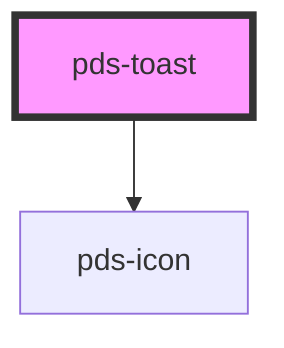

# pds-toast

<!-- Auto Generated Below -->

## Properties

| Property                   | Attribute      | Description                                                                                                                                             | Type                                 | Default     |
| -------------------------- | -------------- | ------------------------------------------------------------------------------------------------------------------------------------------------------- | ------------------------------------ | ----------- |
| `componentId` _(required)_ | `component-id` | A unique identifier used for the underlying component `id` attribute.                                                                                   | `string`                             | `undefined` |
| `dismissible`              | `dismissible`  | Whether the toast can be dismissed manually via the close button. Note: This only controls manual dismissal. Auto-dismissal via duration still applies. | `boolean`                            | `true`      |
| `duration`                 | `duration`     | The duration in milliseconds to show the toast before auto-dismissing. Set to 0 to disable auto-dismiss.                                                | `number`                             | `4500`      |
| `icon`                     | `icon`         | The icon to display in the toast.                                                                                                                       | `string`                             | `undefined` |
| `type`                     | `type`         | The type of toast to display. - default: Grey background (default) - danger: Red background - loading: With spinner animation                           | `"danger" \| "default" \| "loading"` | `'default'` |

## Events

| Event               | Description                                                                  | Type                                     |
| ------------------- | ---------------------------------------------------------------------------- | ---------------------------------------- |
| `pdsToastDismissed` | Event emitted when the toast is dismissed, either manually or automatically. | `CustomEvent<{ componentId?: string; }>` |

## Methods

### `dismiss() => Promise<void>`

#### Returns

Type: `Promise<void>`

## Dependencies

### Depends on

- pds-icon

### Graph

----------------------------------------------

