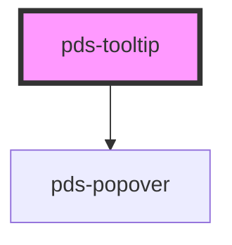

# pds-tooltip

<!-- Auto Generated Below -->

## Properties

| Property      | Attribute      | Description                                                                                                                                                                                                                                                                                                                                                                                                                                                                                                                                                                                                                          | Type                                                                                                                                                                 | Default     |
| ------------- | -------------- | ------------------------------------------------------------------------------------------------------------------------------------------------------------------------------------------------------------------------------------------------------------------------------------------------------------------------------------------------------------------------------------------------------------------------------------------------------------------------------------------------------------------------------------------------------------------------------------------------------------------------------------ | -------------------------------------------------------------------------------------------------------------------------------------------------------------------- | ----------- |
| `componentId` | `component-id` | A unique identifier used for the underlying component `id` attribute.                                                                                                                                                                                                                                                                                                                                                                                                                                                                                                                                                                | `string`                                                                                                                                                             | `undefined` |
| `content`     | `content`      | Content for the tooltip. If HTML is required, use the content slot                                                                                                                                                                                                                                                                                                                                                                                                                                                                                                                                                                   | `string`                                                                                                                                                             | `undefined` |
| `hasArrow`    | `has-arrow`    | Determines whether or not the tooltip has an arrow                                                                                                                                                                                                                                                                                                                                                                                                                                                                                                                                                                                   | `boolean`                                                                                                                                                            | `true`      |
| `hoisted`     | `hoisted`      | Determines how the popover is positioned relative to the trigger element. By default, the popover will use `absolute` positioning, which allows the popover to scroll with the page. Setting this to `fixed` handles most used. However, if the trigger element is within a container that has `overflow: hidden` set, the popover will not be able to escape the container and get clipped. In this case, you can set the `hoisted` property to `true` to use `fixed` positioning instead. Be aware that this is less performant, as it requires recalculating the popover position on scroll. Only use this option if you need it. | `boolean`                                                                                                                                                            | `false`     |
| `htmlContent` | `html-content` | Enable this option when using the content slot                                                                                                                                                                                                                                                                                                                                                                                                                                                                                                                                                                                       | `boolean`                                                                                                                                                            | `false`     |
| `offset`      | `offset`       | Sets the offset distance(in pixels) between the popover and the trigger element                                                                                                                                                                                                                                                                                                                                                                                                                                                                                                                                                      | `number`                                                                                                                                                             | `12`        |
| `opened`      | `opened`       | Determines whether or not the tooltip is visible                                                                                                                                                                                                                                                                                                                                                                                                                                                                                                                                                                                     | `boolean`                                                                                                                                                            | `false`     |
| `padding`     | `padding`      | Sets the padding(in pixels) of the popover content element                                                                                                                                                                                                                                                                                                                                                                                                                                                                                                                                                                           | `number`                                                                                                                                                             | `14`        |
| `placement`   | `placement`    | Determines the preferred position of the tooltip                                                                                                                                                                                                                                                                                                                                                                                                                                                                                                                                                                                     | `"bottom" \| "bottom-end" \| "bottom-start" \| "left" \| "left-end" \| "left-start" \| "right" \| "right-end" \| "right-start" \| "top" \| "top-end" \| "top-start"` | `'right'`   |

## Events

| Event            | Description                       | Type               |
| ---------------- | --------------------------------- | ------------------ |
| `pdsTooltipHide` | Emitted after a tooltip is closed | `CustomEvent<any>` |
| `pdsTooltipShow` | Emitted after a tooltip is shown  | `CustomEvent<any>` |

## Methods

### `hideTooltip() => Promise<void>`

Hides the tooltip by disabling the opened property

#### Returns

Type: `Promise<void>`

### `showTooltip() => Promise<void>`

Shows the tooltip by enabling the opened property

#### Returns

Type: `Promise<void>`

## Slots

| Slot          | Description                  |
| ------------- | ---------------------------- |
| `"(default)"` | The tooltip's target element |
| `"content"`   | HTML content for the tooltip |

## Dependencies

### Depends on

- [pds-popover](../pds-popover)

### Graph

----------------------------------------------

