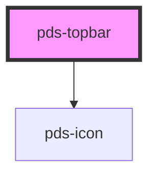

# pds-topbar

<!-- Auto Generated Below -->

## Properties

| Property             | Attribute              | Description                                                                                                                                                                                                                | Type      | Default               |
| -------------------- | ---------------------- | -------------------------------------------------------------------------------------------------------------------------------------------------------------------------------------------------------------------------- | --------- | --------------------- |
| `componentId`        | `component-id`         | A unique identifier used for the underlying component `id` attribute.                                                                                                                                                      | `string`  | `undefined`           |
| `logoAlt`            | `logo-alt`             | Accessible alt text for the default logo image, and the accessible label for the logo link when `logoHref` is set.                                                                                                         | `string`  | `'Home'`              |
| `logoHref`           | `logo-href`            | If provided, wraps the logo in a link to this URL.                                                                                                                                                                         | `string`  | `undefined`           |
| `logoSrc`            | `logo-src`             | Image source for the default logo rendering. Ignored if the `logo` slot has content.                                                                                                                                       | `string`  | `undefined`           |
| `menuButton`         | `menu-button`          | Shows a navigation-toggle button before the logo. Pair with `menuButtonControls`.                                                                                                                                          | `boolean` | `false`               |
| `menuButtonControls` | `menu-button-controls` | The `id` of the element the menu button controls (its `aria-controls` target) — typically a `pds-app` `nav` slot's container.                                                                                              | `string`  | `undefined`           |
| `menuButtonLabel`    | `menu-button-label`    | Accessible label for the menu-toggle button. Pass a translated string to localize it.                                                                                                                                      | `string`  | `'Toggle navigation'` |
| `menuExpanded`       | `menu-expanded`        | Whether the controlled navigation is currently expanded. The consumer owns this state — `pds-topbar` only reflects it into `aria-expanded` and toggles it locally when uncontrolled updates aren't wired up by the caller. | `boolean` | `false`               |

## Events

| Event           | Description                                     | Type                                  |
| --------------- | ----------------------------------------------- | ------------------------------------- |
| `pdsMenuToggle` | Emitted when the menu-toggle button is clicked. | `CustomEvent<{ expanded: boolean; }>` |

## Slots

| Slot          | Description                                                                             |
| ------------- | --------------------------------------------------------------------------------------- |
| `"(default)"` | Right-aligned actions (buttons, avatar, dropdown menu).                                 |
| `"logo"`      | Custom logo markup. Falls back to an `` built from `logoSrc`/`logoAlt` when empty. |

## Dependencies

### Depends on

- pds-icon

### Graph

----------------------------------------------

