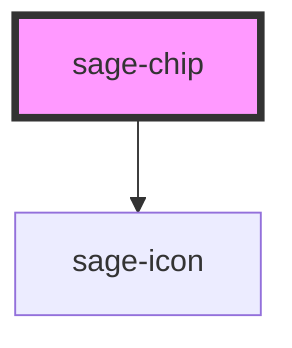

# sage-chip

<!-- Auto Generated Below -->

## Properties

| Property    | Attribute   | Description                                                      | Type                                                                    | Default     |
| ----------- | ----------- | ---------------------------------------------------------------- | ----------------------------------------------------------------------- | ----------- |
| `dot`       | `dot`       | Determines whether a dot should be displayed on the chip.        | `boolean`                                                               | `undefined` |
| `label`     | `label`     | Sets the text label content of the chip.                         | `string`                                                                | `undefined` |
| `large`     | `large`     | Determines whether the chip should be rendered in a larger size. | `boolean`                                                               | `undefined` |
| `sentiment` | `sentiment` | Sets the color scheme of the chip.                               | `"accent" \| "danger" \| "info" \| "neutral" \| "success" \| "warning"` | `'neutral'` |
| `variant`   | `variant`   | Sets the style variant of the chip.                              | `"dropdown" \| "tag" \| "text"`                                         | `'text'`    |

## Events

| Event               | Description                                        | Type               |
| ------------------- | -------------------------------------------------- | ------------------ |
| `sageTagCloseClick` | Event when close button is clicked on tag variant. | `CustomEvent<any>` |

## Dependencies

### Depends on

- sage-icon

### Graph

----------------------------------------------

