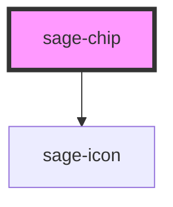

# sage-chip

<!-- Auto Generated Below -->

## Properties

| Property  | Attribute | Description | Type                                                                  | Default     |
| --------- | --------- | ----------- | --------------------------------------------------------------------- | ----------- |
| `color`   | `color`   |             | `"danger" \| "draft" \| "info" \| "locked" \| "success" \| "warning"` | `'draft'`   |
| `label`   | `label`   |             | `string`                                                              | `undefined` |
| `status`  | `status`  |             | `boolean`                                                             | `undefined` |
| `variant` | `variant` |             | `"dropdown" \| "tag" \| "text"`                                       | `'text'`    |

## Dependencies

### Depends on

- sage-icon

### Graph

----------------------------------------------

