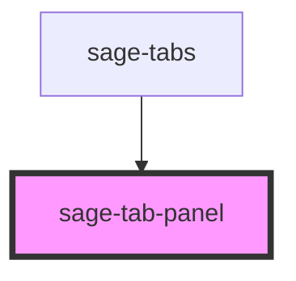

# sage-tabs

<!-- Auto Generated Below -->

## Properties

| Property           | Attribute            | Description | Type     | Default     |
| ------------------ | -------------------- | ----------- | -------- | ----------- |
| `activeTab`        | `active-tab`         |             | `string` | `undefined` |
| `ariaControlledBy` | `aria-controlled-by` |             | `string` | `undefined` |
| `tab`              | `tab`                |             | `string` | `undefined` |

## Dependencies

### Used by

 - [sage-tabs](../sage-tabs)

### Graph

----------------------------------------------

