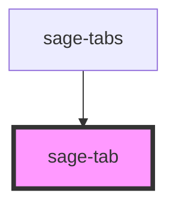

# sage-tabs

<!-- Auto Generated Below -->

## Properties

| Property    | Attribute    | Description | Type     | Default     |
| ----------- | ------------ | ----------- | -------- | ----------- |
| `activeTab` | `active-tab` |             | `string` | `undefined` |
| `tab`       | `tab`        |             | `string` | `undefined` |

## Events

| Event      | Description | Type                  |
| ---------- | ----------- | --------------------- |
| `tabClick` |             | `CustomEvent<string>` |

## Dependencies

### Used by

 - [sage-tabs](../sage-tabs)

### Graph

----------------------------------------------

