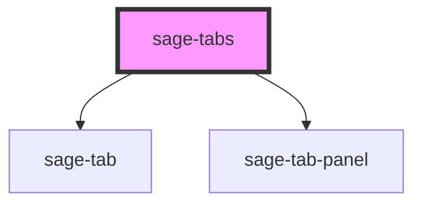

# sage-tabs

<!-- Auto Generated Below -->

## Properties

| Property       | Attribute       | Description | Type     | Default           |
| -------------- | --------------- | ----------- | -------- | ----------------- |
| `tablistLabel` | `tablist-label` |             | `string` | `"tablist label"` |

## Dependencies

### Depends on

- [sage-tab](../sage-tab)
- [sage-tab-panel](../sage-tab-panel)

### Graph

----------------------------------------------

